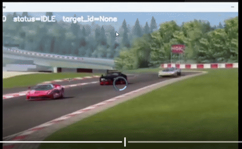
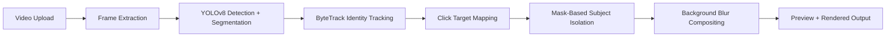

# BlurGoBrr

AI-based smart autofocus and dynamic subject tracking for videos.

<p align="center">
  
</p>

BlurGoBrr lets a user click any subject in a video, lock focus onto it, keep that subject sharp across frames, and blur the background for a cinematic depth-of-field effect. The goal is simple: make autofocus feel interactive, object-aware, and usable beyond face-only detection.

## What It Does

- Click any visible object in a video and select it as the focus target
- Track the selected subject across frames using persistent identity tracking
- Keep the target sharp while applying blur to the rest of the frame
- Switch focus by clicking another object
- Preview frames, play/pause video, render output, and download the final result

## Why It Matters

Traditional autofocus systems usually depend on faces, center-frame assumptions, or predefined subjects. BlurGoBrr explores a more flexible workflow: the user decides what matters, and the system follows that object through motion, camera changes, and partial occlusion.

This is useful for:

- Sports clips and racing footage
- Cinematic video editing
- Content creation tools
- Smart camera autofocus systems
- Surveillance and analytics workflows
- Interactive computer vision demos

## System Architecture



## Core Pipeline

| Layer | Role |
| --- | --- |
| Vision engine | Detects objects, generates masks, tracks identities, and composites blur. |
| Backend | Handles uploads, frame state, target selection, rendering, and download endpoints. |
| Frontend | Provides upload UI, frame preview, click-to-select interaction, playback, and render controls. |

## Technical Highlights

- YOLOv8 segmentation-style object detection and mask generation
- ByteTrack-style persistent multi-object tracking
- Click-to-identity locking so the selected physical object remains the target
- Segmentation-based blur instead of rough bounding-box blur
- OpenCV frame processing and Gaussian blur compositing
- FastAPI-style backend API for upload, preview, selection, reset, render, and download
- Designed for GPU acceleration during heavier inference workloads

## API Shape

```text
POST /upload      Upload a video
GET  /frame       Fetch preview/current frame
POST /select      Select target object from click coordinates
POST /reset       Clear target focus
POST /render      Render output video
GET  /download    Download final rendered video
```

## Local Setup

```bash
git clone https://github.com/scienstien/BlurGoBrr.git
cd BlurGoBrr
python -m venv venv
```

On Windows:

```powershell
venv\Scripts\activate
pip install -r requirements.txt
```

Run the backend:

```bash
uvicorn api_ml:app --host 0.0.0.0 --port 8000
```

Open the frontend from the `frontend/` folder or serve it with your preferred local static server.

Useful checks:

```text
http://localhost:8000/health
http://localhost:8000/docs
```

## Project Structure

```text
BlurGoBrr/
├── api_ml.py              # Backend API entrypoint
├── main.py                # Local/OpenCV test flow
├── src/                   # Focus engine and processing logic
├── frontend/              # Browser UI
├── scripts/               # Setup/deployment helpers
├── assets/                # README/demo assets
├── requirements.txt
├── Dockerfile
└── docker-compose.yml
```

## Challenges Solved

- Mapping click coordinates correctly after frame resizing
- Preserving identity across motion and occlusion
- Avoiding box-shaped blur artifacts by using segmentation masks
- Keeping preview interactions responsive while processing video frames
- Separating backend state, model inference, and frontend controls cleanly

## Roadmap

- Live webcam mode
- WebRTC streaming support
- Depth-aware blur
- Mobile-friendly UI
- Edge-device optimization
- Cloud deployment with GPU-backed workers

## Built With

Python, OpenCV, FastAPI, YOLO-style segmentation, ByteTrack-style tracking, HTML/CSS/JavaScript, Docker.